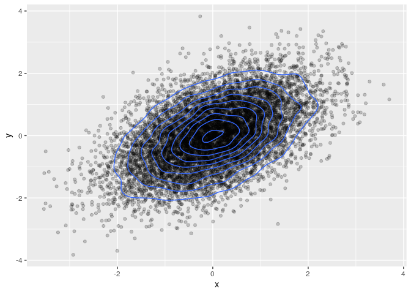

This .Rmd file can be composed into a Notebook result (.html or .pdf)
with RStudio. Any of the R code chunks can also be submitted or be part
of a batch Rscript submission.

Before we begin, note that an amazing collection of ggplot2 and other R
graphics examples that go way beyond this short tutorial and include
animations as well as interactive graphics is available at [The R Graph
Gallery](https://www.r-graph-gallery.com/).

However, it is useful to start with some basics so The R Graph Gallery
makes more sense.

First, we load the library.

    library(ggplot2)

Next, consider the `mpg` dataset that is included with the ggplot2
library.

    tail(mpg)

    ## # A tibble: 6 x 11
    ##   manufacturer model  displ  year   cyl trans drv     cty   hwy fl    class
    ##   <chr>        <chr>  <dbl> <int> <int> <chr> <chr> <int> <int> <chr> <chr>
    ## 1 volkswagen   passat   1.8  1999     4 auto… f        18    29 p     mids…
    ## 2 volkswagen   passat   2    2008     4 auto… f        19    28 p     mids…
    ## 3 volkswagen   passat   2    2008     4 manu… f        21    29 p     mids…
    ## 4 volkswagen   passat   2.8  1999     6 auto… f        16    26 p     mids…
    ## 5 volkswagen   passat   2.8  1999     6 manu… f        18    26 p     mids…
    ## 6 volkswagen   passat   3.6  2008     6 auto… f        17    26 p     mids…

ggplot is based on the Grammar of Graphics decomposition of graphing
concepts, which allows very high-level control over graphics along with
the ability to tune fine details. It is currently used by publications
like [The Upshot at The New York
Times](https://flowingdata.com/tag/upshot/) and at [The
BBC](https://bbc.github.io/rcookbook/) due to its ability to quickly
prototype complex custom graphics.

Grphics are decomposed into layers. Let's begin with an empty xy-plot.
The aesthetics `aes()` function assigns `x = cty` and `y = hwy`.

    g = ggplot(mpg, aes(cty, hwy))
    g

Now we add `geom_point()` to tell ggplot how to represent the xy data.
The `print()` can be ommitted as the `print()` method is the default for
an object that is not assigned.

    g = ggplot(mpg, aes(cty, hwy)) +
        geom_point()
    g

Add another layer with a LOESS (locally estimated scatterplot smoothing)
regression line and a confidence region (95% by default) for the line.
Also note that one can just add to a previously generated plot
specification.

    g + geom_smooth()

    ## `geom_smooth()` using method = 'loess' and formula 'y ~ x'

Customize axes, theme, etc. Notably, we choose generalized additive
models from the package `mgcv` to fit thin plate splines with
crossvalidation to the data instead of the default LOESS above. Again, a
95% confidence region is shown for the local mean.

    g = ggplot(mpg, aes(cty, hwy)) +
        geom_point(shape = 21, size = 2) +
        geom_smooth(method = mgcv::gam, formula = y ~ s(x, bs = "tp")) +
        labs(x = "City", y = "Highway", title = "Miles Per Gallon") +
        theme_bw()
    g

Now change the aesthetics to `x = hwy`, dropping the `y`, and its
representation to a histogram.

    g = ggplot(mpg, aes(hwy)) +
        geom_histogram()
    g

    ## `stat_bin()` using `bins = 30`. Pick better value with `binwidth`.

Customize the histogram. Note that aesthetics are attributes that depend
on data (such as the fill color below) whereas data-independent
attributes (such as number of bins and outline color below) are
specified in the `geom`s.

    g = ggplot(mpg, aes(x = hwy, fill = factor(cyl))) +
        geom_histogram(bins=20, size=0.25, color = "black")
    g

Plot a histogram for each value of `cyl`.

    g = ggplot(mpg, aes(hwy)) +
        geom_histogram(bins=20, fill="blue", color="black", size=0.25) +
        facet_wrap(~ cyl)
    g

Plot boxplots for each value of `class`.

    g = ggplot(mpg, aes(class, hwy)) +
        geom_boxplot()
    g

Plot two boxplots together horizontally.

    library(gridExtra)

    g = ggplot(mpg, aes(class, hwy)) +
        geom_boxplot()
    h = ggplot(mpg, aes(class, cty)) +
        geom_boxplot()
    grid.arrange(g, h)

Suppose we have a time series, *y**t*, that is an
autoregressive Gaussian process of order 2, denoted by AR(2):
Generate the AR(2) series and plot it. We start with `set.seed()` for
reproducible results.

    set.seed(538)
    y = arima.sim(n = 200, list(ar = c(0.5, -0.2), sd = sqrt(0.25)))
    dat = data.frame(t = 1:200, y = as.numeric(y))
    g = ggplot(dat, aes(t, y)) + geom_line()
    g

What about plotting multiple series on one plot? First, simulate the
series.

    n = 12*60
    y1 = 0 + arima.sim(n = n, list(ar = c(0.5, -0.2), sd = sqrt(0.25)))
    y2 = 3 + arima.sim(n = n, list(ar = c(0.1, -0.2), sd = sqrt(0.25)))
    y3 = -3 + arima.sim(n = n, list(ar = c(0.7, -0.2), sd = sqrt(0.5)))

Make the series the columns of a `data.frame` along with a time
variable.

    dat = data.frame(time = 1:n, y1 = as.numeric(y1), y2 = as.numeric(y2), y3 = as.numeric(y3))
    head(dat, 3)

    ##   time        y1       y2        y3
    ## 1    1 -1.227759 3.974842 -3.045069
    ## 2    2 -1.534146 2.083666 -4.026038
    ## 3    3 -1.244123 2.648035 -4.798528

Gather the `data.frame` variables (except `time`) by stacking the series
vertically. The `tidyr` package is part of the `tidyverse` group of
packages, which include `ggplot2` as well. Note that we are not loading
the `tidyr` library into our namespace and only invoking its `gather`
function.

    newdat = tidyr::gather(dat, key = "key", value = "value", -time)
    head(newdat)

    ##   time key      value
    ## 1    1  y1 -1.2277594
    ## 2    2  y1 -1.5341458
    ## 3    3  y1 -1.2441234
    ## 4    4  y1  2.3452855
    ## 5    5  y1  2.5939705
    ## 6    6  y1  0.6996064

    tail(newdat)

    ##      time key     value
    ## 2155  715  y3 -3.351881
    ## 2156  716  y3 -3.591867
    ## 2157  717  y3 -2.793898
    ## 2158  718  y3 -3.452302
    ## 2159  719  y3 -5.155792
    ## 2160  720  y3 -5.579000

A `gather`ed data frame allows ploting the series together and using the
`key` variable for data-dependent attributes.

    g = ggplot(newdat, aes(x = time, y = value,
                group = key,
                color = key,
                linetype = key)) +
        geom_line() +
        theme(legend.position = "bottom") +
        ggtitle("Multiple Series")
    g

If time is in minutes, perhaps the plot should be on a 12 hour polar
coordinate clock?

    g + coord_polar() + scale_x_time()

Draw from bivariate normal.

    library(mvtnorm)
    Sigma = matrix(c(1, 1/2, 1/2, 1), 2, 2)
    x = rmvnorm(n = 10000, mean = c(0,0), sigma = Sigma)
    dat = data.frame(x)
    colnames(dat) = c("x", "y")

Plot the points and superimpose contours.

    g = ggplot(dat, aes(x=x, y=y)) +
        geom_point(alpha = 0.2) +
        geom_density2d()
    g

### For an amazing collection of ggplot2 and other R graphics examples that go way beyond this short tutorial and include animations as well as interactive graphics see [The R Graph Gallery](https://www.r-graph-gallery.com/).
