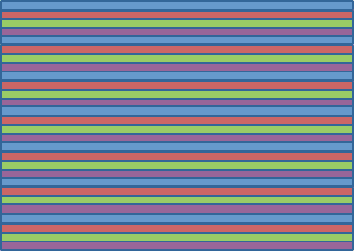
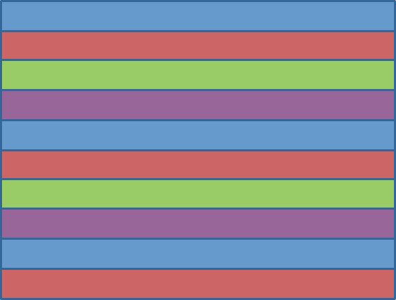
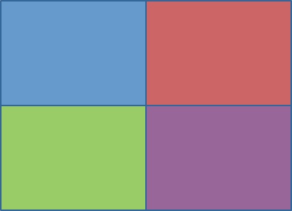
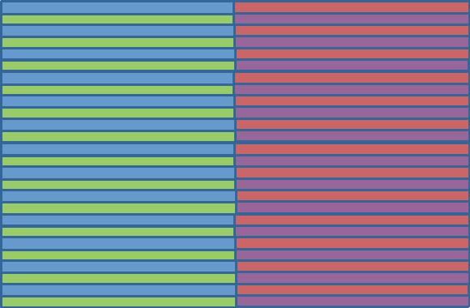
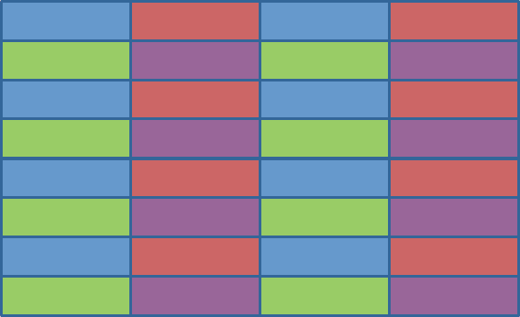
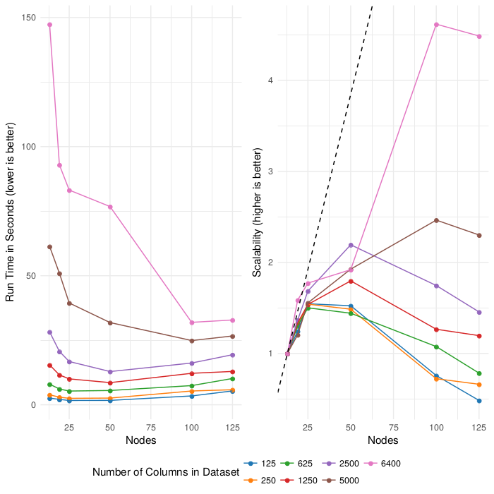
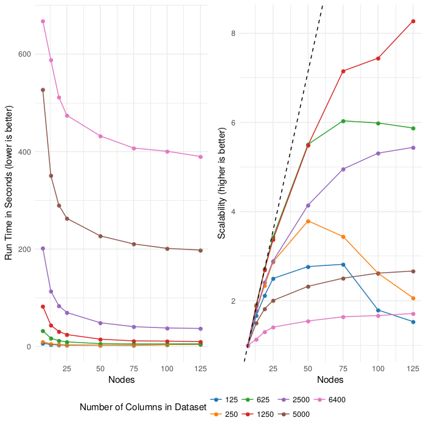
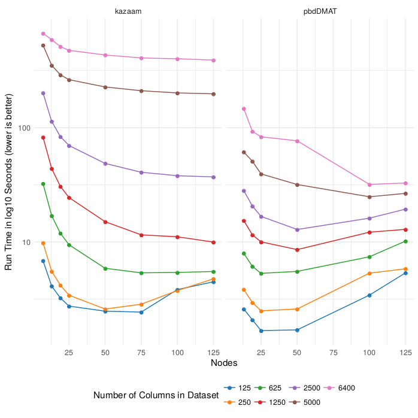

# Distributed Matrices the pbdR Way


## Background

In contrast to task parallelism, which we described in our [task parallelism tutorial](tasktools.md), in this tutorial we will be discussing data parallelism.


## Data Distribution Schemes

Before talking about the pbdR packages that support distributed matrices, we need to discuss different ways of distributing data.

A very common way of distributing 
Data is distributed "by row", meaning that rows are contiguous on the MPI ranks. Said another way, if a process owns any part of a row, then it owns the entire row. For many common operations, this makes the communication scale as a function of the number of columns, hence why it is meant for "tall and skinny" data. For most linear algebra operations of interest, this is not a good way of distributing square or square-ish data.

(i.e. if a process owns one element of a row, it owns all of the other elements)


The 2-d block-cyclic format is very complicated, so it is worth spending some time discussing the particulars of this data layout. First, what do we mean by "2-d"? In ordinary MPI applications, you use a 1-dimensional (1-d) grid of processes. Each process is assigned a rank, 0 to one less than the number of processes. We can treat 1-d distributions as a degenerate case of 2-d ones while we better understand the "block-cyclic" component.

For now, imagine you have a large matrix that you wish to distribute pieces of to a 1-d collection of processes, and you want to do this by-row. 

By a "block" layout, we 
This can become degenerate into strange and usually undesirable cases if one is not careful. For example, if the block size is chosen to be larger than the number of rows of the matrix, then the first process will own all of the data, and all later processes in the 1-d grid will own nothing. This is allowed under our definition, but probably not a good idea, since it's not really distributed.

cyclic

Finally, there is the block-cyclic layout. This combines the two concepts "block" and "cyclic", hence the name. A block size is set and the rows of the matrix are divided across the processes into blocks, and when the , you cycle back to the beginning of the MPI processes.

A block-cyclic layout where the block size is chosen so that it only cycles once is just an ordinary block layout. There are other degenerate cases one can consider, but it's best not to dwell too much on this.

Below we visualize these layouts with 4 MPI processes. Each color represents an MPI process, and any row of the matrix colored say blue will belong to the first MPI rank.

<span class="image">
  <table align="center">
    <tr>
      <th>
        
        <br>
        1-d Block layout
      </th>
      <th>
        
        <br>
        1-d Cyclic layout
      </th>
      <th>
        
        <br>
        1-d Block-cyclic layout
      </th>
    </tr>
  </table>
</span>

We support a 2-d grid of processes

<span class="image">
  <table align="center">
    <tr>
      <th>
        
        <br>
        2-d Block layout
      </th>
      <th>
        
        <br>
        2-d Cyclic layout
      </th>
      <th>
        
        <br>
        2-d Block-cyclic layout
      </th>
    </tr>
  </table>
</span>


## Overview of kazaam

The [kazaam package](https://github.com/RBigData/kazaam) is a high-level framework for distributed linear algebra and statistics. The package is optimized for very tall matrices with comparatively few columns. In the package, we call the objects "shaqs", basically a joke about how Shaq is very tall. 

There is some skeleton support in kazaam for "short and wide" data, which we call "tshaqs".

Once the data is stored in a shaq, many linear algebra and machine learning methods become immediately available.


## Some kazaam Examples


## Overview of pbdDMAT

Like kazaam, the pbdDMAT package is also a high-level framework for distributed linear algebra and statistics. But unlike kazaam, it uses a 2-dimensional block-cyclic data decomposition.

(ScaLAPACK)

* Syntax often identical to base R
    - Helpers: `[`, `rbind()`, `apply()`, ...
    - Linear algebra: `%*%`, `svd()`, `qr()`, ...
    - Basic statistics: `median()`, `mean()`, `rowSums()`, ...
    - Multivariate statistics: `lm.fit()`, `prcomp()`, `cov()`, ...
* Extensive R syntax support makes computing easy; the hard part is often getting the data into the right format.
* Data must be distributed as 2-d block-cyclic


`init.grid()` grids


## pbdDMAT vs kazaam
* pbdDMAT much more thorough (sort of has to be...)
* Both have similar analytics capabilities (clustering, classifiers, dimension reduction, ...)
* kazaam presently works better on GPU's
    - ECP slate may change this
    - both DIY right now
* Can redistribute from one layout to the other fairly easily


## Benchmarks
Percival
* Cray XC40
* 168 nodes
* 10,752 cores
* 21 TiB of RAM


```r
x = ranshaq(rnorm, m.local, n, local=TRUE)

time = comm.timer(svd(x, nu=0, nv=0))
```

While pbdDMAT has an `svd()` method, it uses a very different algorithm from the one used by kazaam. Specifically, kazaam computes the eigenvalue decomposition of `crossprod(x)`. This has numerical accuracy and run time implications. So to make the test more fair, we have to do implement this ourselves. Fortunately, this is very simple: 

```r
x = ddmatrix("rnorm", m, n, ICTXT=2)

cpsvd = function(x)
{
  cp = crossprod(x)
  eigen(cp, symmetric=TRUE, only.values=TRUE)
}

time = comm.timer(cpsvd(x))
})
```


pbdDMAT


kazaam


pbdDMAT vs kazaam

