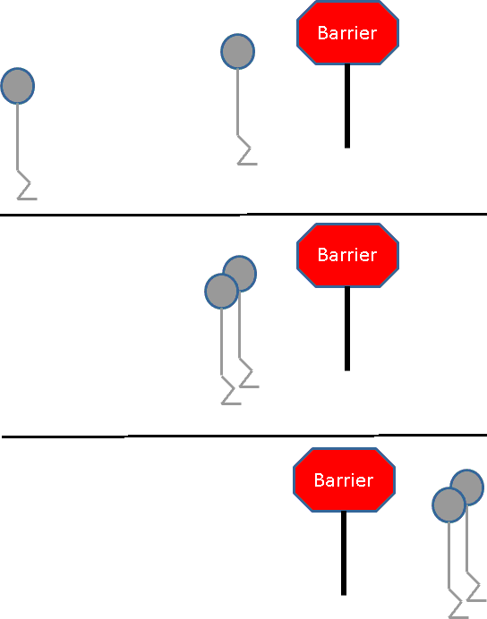
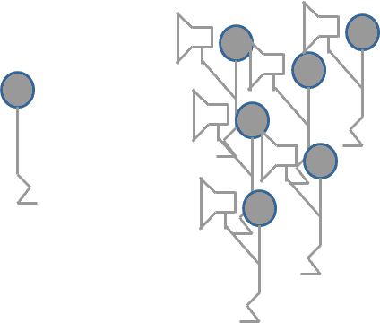

# Parallel Computing with R and MPI via pbdMPI


## Background

Before getting into the details here, it is useful to spend a second talking about some of the programming paradigms we will be using. Most MPI codes are written in Single Program/Multiple Data (SPMD). The basic idea is that you write one program (in this case, an R script), and all of the processes will run that same script. The parallelism comes from them doing whatever it is they need to do on their subset of data, which differs from the data held on other processes.

Today, most parallelism used by R programmers falls under the "manager/worker" (sometimes called "master/worker" or "master/slave"). Here, one process (the manager) is held out to manage the worker processes. Sometimes this is a useful strategy, for example when trying to compute many heterogeneous tasks that complete at unknown times. However, it is generally much less scalable than SPMD. The real life analogue is to imagine having a manager having to instruct all works of their tasks any time they did anything, versus self-organizing workers. Which would you expect to be able to get more work done?

In practice, SPMD codes will have some manager/worker sections. Whenever something special is only done on "rank 0" (more on that later), this is exactly what is going on. But in SPMD programs, these sections are generally fairly basic. I/O is commonly handled in this way, before proceeding to the main SPMD-written part of the program.

You can read more about SPMD at the [SPMD wikipedia article](https://en.wikipedia.org/wiki/SPMD).

We will also be running all of our programs in batch, as opposed to interactively. This means that you will need to save the R code into an R script file and execute it with `Rscript`. Losing interactivity can be challenging at first, but interactivity itself is a kind of manager/worker-ism that we have to break to achieve good performance when running at very large scale.


## Basics

MPI refers to the Message Passing Interface. It is the standard for managing communications (data and instructions) between different nodes/processes in HPC environments. There are a variety of implementations of the MPI standard, such as OpenMPI, MPICH2, Cray MPT, IBM's Spectrum, and on and on. Which one you use will depend on your machine.

MPI handles communication via a construct known as a *communicator*. Basically this manages the communications between processes. Although some think of MPI as "low level", compared to most distributed programming standards, from a certain perspective it is actually quite high level (you can take this as a commentary on distributed programming models if you like). For example, network programming with sockets is very different than doing things over InfiniBand with ibverbs. With MPI, you do not need to manually manage these low level details yourself. The pbdMPI package makes dealing with MPI even friendlier and easier than dealing with "raw" MPI in C or Fortran. We also provide numerous additional packages on top of MPI and pbdMPI solving very specific tasks. In this way, you may think of "low/high" level as a spectrum.

Let's turn to some specifics now. In standard MPI, you have to manually initialize the communicator. However, in pbdMPI you do not. But if this makes you uncomfortable, you can call `init()` and no harm will come to your program. However, and we must stress this: you **must** call `finalize()` when you are finished. Calling `finalize()` will shut down all of the MPI communicators and internals. Failing to call this in your R script will lead to very verbose and annoying errors from MPI.

An MPI communicator defines the concept of a *rank*. A rank is the unique (to that communicator) number assigned to the calling process identifying it. 

* Rank
    - R command: `comm.rank()`
    - Answers the question: among the many, who am I?
    - Zero-indexed numbering
* Size
    - R command: `comm.size()`
    - Answers the question: how many of us are there?

**Recap**:

* Finish every MPI-using R script with a call to `finalize()`.
* Use `comm.rank()` (zero-indexed!) to figure out which rank the caller is
* Use `comm.size()` to figure out how many ranks there are.


## A Pinch of Sugar

The pbdMPI package has numerous helper utilities. In this section we will discuss a few of the more important ones.

### Printing

If you want to print things, then just using `print()` works fine when only one process is doing anything. But you don't want tens or hundreds of processes fighting over who gets to print. This is where `comm.print()` and `comm.cat()` are helpful. These are analogues of the `print()` and `cat()` functions, respectively. Here's a quick example:

```r
suppressMessages(library(pbdMPI))

my.rank = comm.rank()
comm.print(my.rank, all.rank=TRUE)

finalize()
```

We can save this in the file `print_rank.r` and execute it on 2 MPI ranks as follows:

```bash
$ mpirun -np 2 Rscript print_rank.r
## COMM.RANK = 0
## [1] 0
## COMM.RANK = 1
## [1] 1
```

Extreme caution should be used with these functions. If you use them on any yet-to-be-computed expression that involves communication, it will cause the processes to hang. **As a matter of caution, it is best to only ever call these functions on an already computed object**. In this example, there is no harm in instead doing `comm.print(comm.rank())` because the function `comm.rank()` does not do any communication. However, we still advise against doing this sort of thing in general.

And for the sake of completion, here's a little 'hello world':

```r
suppressMessages(library(pbdMPI))

msg = paste("Hello from rank", comm.rank(), "of", comm.size())
comm.print(msg, all.rank=TRUE, quiet=TRUE)

finalize()
```

If we save this in the file `hello.r`, then we can run it on 2 ranks as follows:

```bash
$ mpirun -np 2 Rscript hello.r
## [1] "Hello from rank 0 of 2"
## [1] "Hello from rank 1 of 2"
```

### Task Parallelism

It's very common to have a bunch of independent tasks that you want to compute across your various resources. We offer a useful function `get.jid()` to help with deciding which tasks should be completed by which rank. For example, consider:

```r
suppressMessages(library(pbdMPI))

n = 10
id = get.jid(n)
comm.print(id, all.rank=TRUE)

finalize()
```

We can save this file as `jid_example.r` and run some examples via:

```bash
$ mpirun -np 2 Rscript jid_example.r
## COMM.RANK = 0
## [1] 1 2 3 4 5
## COMM.RANK = 1
## [1]  6  7  8  9 10
$ mpirun -np 3 Rscript jid_example.r
## @COMM.RANK = 0
## @[1] 1 2 3
## @COMM.RANK = 1
## @[1] 4 5 6
## COMM.RANK = 2
## [1]  7  8  9 10
$ mpirun -np 4 Rscript jid_example.r
## COMM.RANK = 0
## [1] 1 2
## COMM.RANK = 1
## [1] 3 4
## COMM.RANK = 2
## [1] 5 6 7
## COMM.RANK = 3
## [1]  8  9 10
```

There are also the parallel `lapply()` and `sapply()` functions, `pbdLapply()` and `pbdSapply()`, respectively. These actually manage much of the "job splitting" for you that `get.jid()` handles. These functions have multiple modes of operation depending on how you have the input tasks distributed (or not) and how you want to handle ownership of the return. We just provide a simple example showing how 

```r
suppressMessages(library(pbdMPI))

if (comm.rank() == 0){
  x = 1:10
} else {
  x = NULL
}

ret = pbdSapply(x, function(i) sqrt(i + comm.rank()))
comm.print(ret, all.rank=TRUE)

finalize()
```

If we save this in the file `ply.r`, then we can run it on 2 ranks as follows:

```bash
$ mpirun -np 2 r ply.r
## COMM.RANK = 0
## [[1]]
## [1] 1.000000 1.414214 1.732051 2.000000 2.236068
## 
## [[2]]
## [1] 2.645751 2.828427 3.000000 3.162278 3.316625
## 
## COMM.RANK = 1
## NULL
```

We discuss task parallelism at more depth, including different ways to handle task parallel workloads with pbdR, in [a separate tutorial](tasktools.md).

### Parallel RNG

Finally, there is the matter of random number generation. Since "random" generation isn't truly random, some care must be taken if you want to use (pseudo-)randomness in an R script with multiple processes. The `comm.set.seed()` function handles this for you, using the L'Ecuyer method via the [rlecuyer package](https://cran.r-project.org/web/packages/rlecuyer/index.html). If you want all processes to have the same seed, then use the `diff=FALSE` option. Otherwise, each process will have different local seeds to ensure that the parallel RNG streams do not merge.

**Recap**:

* Printing
    - Print output in a more orderly manner, and optionally with some useful metadata interspersed in the output.
    - R command: `comm.print()` and `comm.cat()`
    - Do not call on a yet-to-be-computed expression if it involves communication!
* Task Parallelism
    - Split many independent tasks across processes
    - R command:
        - `get.jid()` - job id
        - `pbdLapply()` - Parallel `lapply()`
        - `pbdSapply()` - Parallel `sapply()`
* Parallel Seeds
    - Ensure good random number streams when simulating in parallel.
    - R command: `comm.set.seed()`


## Collectives

For the remainder of this document, we will focus on perhaps the four most important MPI collective operations: reduce, broadcast, gather, and barrier.

In this section, we do not provide outputs. You are encouraged to think about what output you would expect to see and then try experimenting with running the code yourself with various numbers of MPI processes.

Figures are reproduced with permission from an old presentation of Jack Dongarra's.

### Barrier

A barrier is sort of what it sounds like: a computation wall. No process is allowed to proceed until *all* processes can proceed.



Barrier is not a free operation (it is a collective, after all). You should try to avoid using barriers if possible.

```r
suppressMessages(library(pbdMPI))

comm.print("starting huge computation...")

if (comm.rank() == 0){
  Sys.sleep(5)
}

barrier()
comm.print("ok!")

finalize()
```

### Broadcast

Broadcasting is a one-to-many operation. It allows you to send an object held on one process to all the others.


And here is an example:

```r
suppressMessages(library(pbdMPI))

if (comm.rank()==0){
  x = matrix(1:4, nrow=2)
} else {
  x = NULL
}

y = bcast(x)

comm.print(x, all.rank=TRUE)
comm.print(y, all.rank=TRUE)

finalize()
```

### Scatter

Scatter is a one-to-many operation that is conceptually similar to a broadcast. However, rather than sending the entirety of one object to all processes, it sends pieces of a list (with exactly `comm.size()` elements) to the various ranks. The first element of the list will go to the first MPI rank (numbered 0 in the communicator), the second element to the second MPI rank (rank 1), and so on.

Here's a quick example using scatter:

```r
suppressMessages(library(pbdMPI))

if (comm.rank() == 0){
  x = lapply(1:comm.size(), identity)
} else {
  x = NULL
}

y = scatter(x)

comm.print(x, all.rank=TRUE)
comm.print(y, all.rank=TRUE)

finalize()
```

### Gather

Gather is a many-to-one operation. It allows you to collect an object held on each process into a single list.



There are two gather functions: 

* `gather()`: gathers to one process, called the root. Said another way, only one MPI rank owns the final answer.
* `allreduce()`: gathers to all processes. Each process owns the final answer.

An example of using a gather operation is provided below:

```r
suppressMessages(library(pbdMPI))

x = comm.rank() + 1
y = gather(x)

comm.print(x, all.rank=TRUE)
comm.print(y, all.rank=TRUE)

finalize()
```

### Reduce

The workhorse of the collectives that solves more problems than it has any right to is the reduction. This is the most difficult idea to explain to the uninitiated, but also perhaps the most important of the MPI collectives.

Imagine that each processor has a number, and you want to add all of the numbers up across the different ranks. This is a classic example of a reduce with the sum operation. You could also pick the largest (max) or smallest (min), for example. In the illustration below, you can imagine each of the MPI ranks as a person voting on something:


This is effectively executed as a reduction. Reductions operate on vectors. So if you had 2 processes, which had vectors, respectively:

0. `x = 1:2`
1. `x = 11:12`

And you were to call `reduce(x)`, then the result would be the length 2 vector containing elements `12` and `14`. If you were to call `reduce(x, op="min")`, then the result would be the vector with elements `1` and `2`.

As with gather, there are two variants: 

* `reduce()`: reduction to one process, called the root. Said another way, only one MPI rank owns the final answer.
* `allreduce()`: reduction to all processes. Each process owns the final answer.

Finally, here is an example:

```r
suppressMessages(library(pbdMPI))

nranks = comm.size()
ret = allreduce(1)

comm.print(nranks)
comm.print(ret)

finalize()
```

**Recap**:

* Barrier
    - Forces processes to wait until all processes are ready to proceed.
    - R command: `barrier()`
    - Avoid if possible.
* Broadcast
    - Send all components of one object from one process to all.
    - R command: `bcast()`
* Scatter
    - Send a different element of a list to each process.
    - R command: `scatter()`
* Gather
    - Collect objects from all ranks into one place.
    - R command: `gather()` and `allgather()`
    - Like a reverse scatter.
* Reduce
    - Operate (add, min, max, ...) on every element of a vector across processes.
    - R command: `reduce()` and `allreduce()`
    - Extremely powerful operation. 

All of these operations are highly optimized and parallel when possible. Especially the Reduce operation takes advantage of associativity of its operations that allows a high degree of parallelism in its communication as well as in the reduction itself. Further, the pbdMPI implementation avoids serialization in most instances, giving a speed advantage over Rmpi.


## Advanced Topics

Though they go beyond the scope of this document, there are many advanced things you can do with pbdMPI. Here are a handful of some useful advanced techniques:

* Point-to-point communication:
    - `send()` - send
    - `recv()` - receive
* Using multiple communicators:
    - Create via `comm.split()`
    - Careful to pass the `comm` argument!
* Passing a communicator from R (managed by pbdMPI) to C:
    - R code: `comm_ptr = pbdMPI::get.mpi.comm.ptr(comm_number)`
    - C code: `MPI_Comm comm = *((MPI_Comm*) R_ExternalPtrAddr(comm_ptr_sexp));`
    - You can find an example in the crossprod internals in the [kazaam package](https://github.com/RBigData/kazaam)
* Use the `spmd.*` functions
    - e.g. `spmd.allreduce.double()` instead of `allreduce()`
    - Not as easy/friendly, but avoids some communication overhead.
