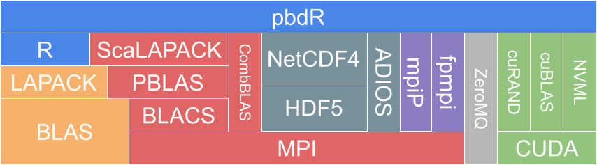

# Why pbdR?

The "Programming with Big Data in R" project (pbdR) is a set of highly scalable R packages for distributed computing and profiling in data science. pbdR packages offer R interfaces to many well-known HPC libraries, like MPI, ZeroMQ, ScaLAPACK, NetCDF4, PAPI, and more. We have many packages, which you can find more about on [our github organization](https://github.com/rbigdata) and on our [tutorials](../../README.md).

Have a question or problem? Feel free to open a GitHub issue on the relevant package. Or feel free to ask a question at our [google group](http://group.pbdr.org/) or send us an email at our mailing list: RBigData AT gmail DOT com.

Finally, if you want to use R and/or pbdR on [OLCF resources like Summit](https://www.olcf.ornl.gov/olcf-resources/compute-systems/summit/), please feel free to contact us directly:

* Mike Matheson - mathesonma AT ornl DOT gov
* George Ostrouchov - ostrouchovg AT ornl DOT gov
* Drew Schmidt - schmidtda AT ornl DOT gov

## For R Programmers

These days there are many options for parallel programming in R. So what advantages does pbdR offer?

1. We focus on scalability and distributed computing. We come from HPC, and so our packages work well in HPC. The only other packages that we are aware of that can even work in these environments are essentially [Rmpi](https://cran.r-project.org/web/packages/Rmpi/index.html) or packages that provide a different interface to Rmpi. pbdR is very different to an Rmpi interface, and we believe we offer much more than the alternatives.
2. We have several packages that work as partial "serial R replacements". Want to do PCA on a giant matrix that won't fit in memory? We can do that with the usual `prcomp()` call, only on a distributed matrix instead of a regular matrix.
3. We offers some unique profilers to R, such as [pbdPROF](https://github.com/RBigData/pbdPROF) for MPI code profiling and [pbdPAPI](https://github.com/RBigData/pbdPAPI) for low-level hardare counter profiling.
4. pbdR isn't a special, custom software environment that is complicated to install. pbdR packages are R packages. Using them is as easy as using R.

What are some disadvantages to pbdR?

1. Interactive programming is more difficult. While it's possible to use pbdR packages interactively with our [client/server framework](https://github.com/rbigdata/pbdCS), this isn't our focus. Most of our packages are meant to be used in the standard programming idiom for HPC, which is batch SPMD. You can read more about this in our [pbdMPI tutorial](./content/pbdR/mpi.md).
2. Our "serial R replacement" ecosystem is not a one-for-one replacement for serial R. There are lots of parts of the core language (nevermind the massive amount of utility offered by CRAN packages) that we do not have distributed versions of.
3. Some of our packages, like our profilers and GPU packages either work best on Linux, or only work at all on Linux.

## For HPC Users

R is a high-level language. In some ways it is similar to other high-level languages that you may be more familiar with, like python. But in many ways, R is quite unique. It has also been around [for quite a long time](https://en.wikipedia.org/wiki/R_(programming_language)#History). Out of the box, R does not play nice with HPC. pbdR packages bridge the gap between using R on the desktop and on the supercomputer.

pbdR packages make extensive use of many of the HPC libraries that you are already familiar with:

